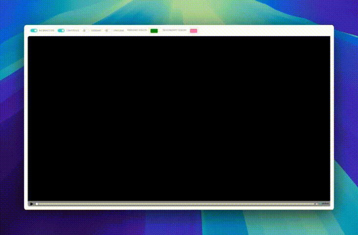

# Shotstack Studio SDK Demos
[](https://codepen.io/Derk-Zomer/pen/KKLaZOK) [](https://codesandbox.io/p/sandbox/studio-sdk-46xjpj)

This repository provides examples of how to use the Shotstack Studio SDK with different frameworks. These demos serve as an entry point to embedding a white-labeled video editor into your own application.

## Table of Contents

- [Overview](#overview)
- [Installation](#installation)
- [Usage](#usage)
- [Examples](#examples)
- [Documentation](#documentation)

## Overview

The Shotstack Studio SDK allows you to embed a powerful video editing studio into your application. This repository contains demos showcasing the SDK's capabilities and how to integrate it into various frameworks.

## Installation

To get started, clone the repository and install the necessary dependencies for each example.

```bash
git clone https://github.com/shotstack/shotstack-studio-sdk.git
cd shotstack-studio-sdk
```

## Usage

Navigate to the example of your choice and follow the instructions in the corresponding README file.

## Examples

### [Javascript](https://github.com/shotstack/shotstack-studio-sdk/tree/master/demos/javascript)

Example demonstrating how to use the SDK with vanilla JS.

### [React](https://github.com/shotstack/shotstack-studio-sdk/tree/master/demos/react)

Example demonstrating how to use the SDK with a React application.

## Documentation

For detailed information on how to use the Shotstack Studio SDK, refer to the official documentation:

- [Studio SDK Guide](https://shotstack.io/docs/guide/studio-sdk/)
- [Embedding the Studio](https://shotstack.io/docs/guide/studio-sdk/embedding-the-studio/)
- [Configuring the Studio](https://shotstack.io/docs/guide/studio-sdk/configuring-the-studio/)
- [Interacting with the Studio](https://shotstack.io/docs/guide/studio-sdk/interacting-with-the-studio/)
